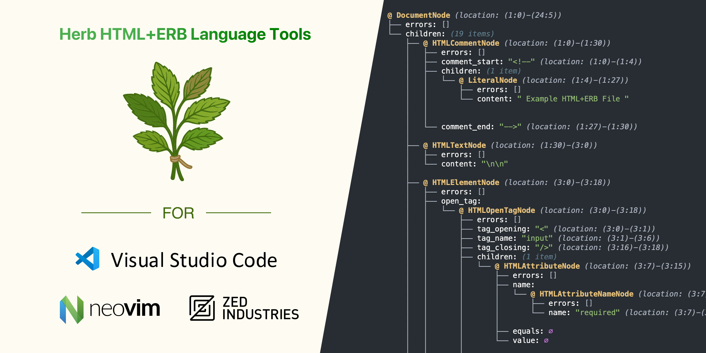

## Herb Language Server

##### Package: [`@herb-tools/language-server`](https://www.npmjs.com/package/@herb-tools/language-server)

---

[Language Server Protocol](https://github.com/Microsoft/language-server-protocol) integration for HTML-aware ERB parsing using the [Herb Parser](https://herb-tools.dev).



### Installation

#### Visual Studio Code

Install the [Herb LSP extension](https://marketplace.visualstudio.com/items?itemName=marcoroth.herb-lsp) from the Visual Studio Marketplace.

#### Cursor (Open VSX Registry)

Install the [Herb LSP extension](https://open-vsx.org/extension/marcoroth/herb-lsp) from the Open VSX Registry.

#### Zed

The Herb Language Server is part of the official [Ruby extension for Zed](https://github.com/zed-extensions/ruby). Just install the Ruby extension in Zed and you should be good to go.

Read more in the [documentation](https://zed.dev/docs/languages/ruby).

#### Neovim (using `nvim-lspconfig`)

Coming soon, see [#3925](https://github.com/neovim/nvim-lspconfig/pull/3925).

#### Manual Installation

You can use the language server in any editor that supports the [Language Server Protocol](https://microsoft.github.io/language-server-protocol/).

##### Install

###### NPM (Global)

```bash
npm install -g @herb-tools/language-server
```

###### Yarn (Global)

```bash
yarn global add @herb-tools/language-server
```

##### Run

```bash
herb-language-server --stdio
```

```
Usage: herb-language-server [options]

Options:

  --stdio          use stdio
  --node-ipc       use node-ipc
  --socket=<port>  use socket
```

##### NPX

Alternatively you can also run the language server directly with `npx` without installing anything:

```bash
npx @herb-tools/language-server --stdio
```
